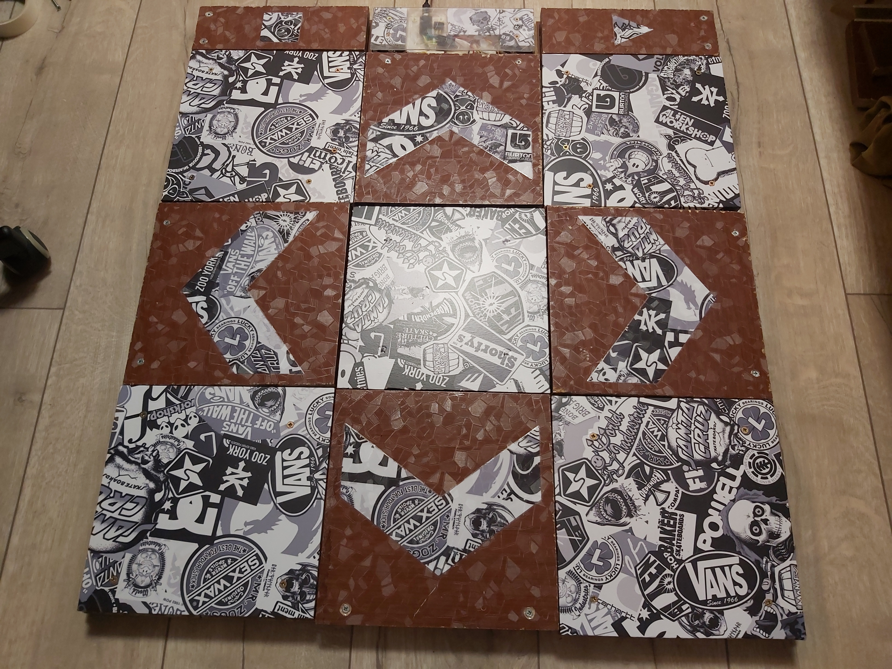
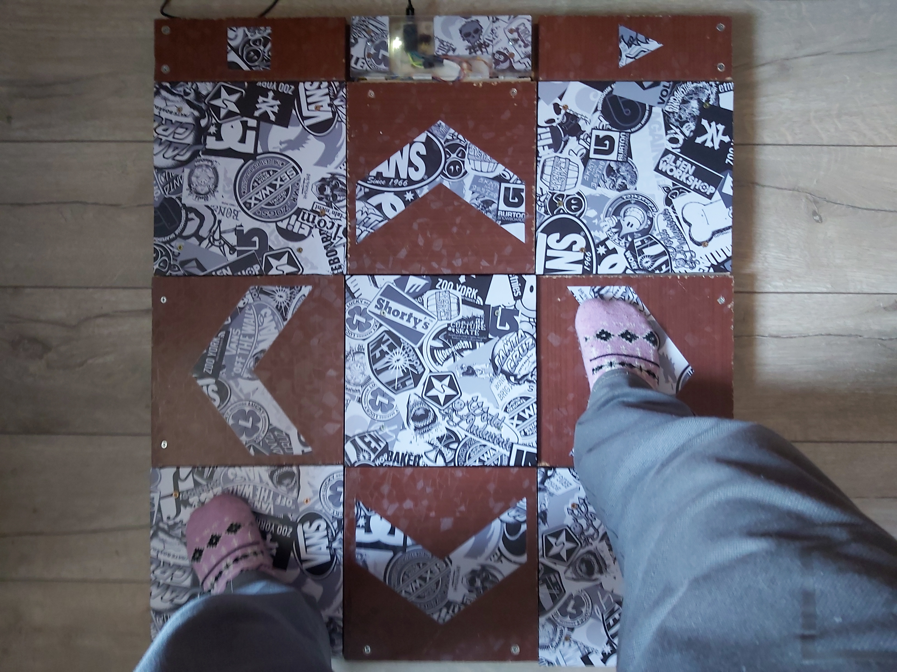

# Dance pad

  

It is made from old furniture.  
Source of inspiration: https://habr.com/ru/articles/235323/   

Electronics is based on Arduino micro.

Dance pad has six buttnos:  
- four direction arrow buttons
- start button
- select button

It have two modes:  

*Keyboard mode*  
Arrow buttons are mapped to arrow keys on keyboard  
Start button is mapped to `Enter (return)`  
Select button is mapped to `ESC`  

*Joystick mode*  
Emulates gamepad  
All buttons are mapped to gamepad buttons  
Gamepad layout is same to common foam dance mats from AliExpress      

Suitable for DanceDanceRevolution, ITG, Stepmania and similar games  
I use it with Project OutFox https://projectoutfox.com/       

  

Some achievements with this pad:  
  
  
